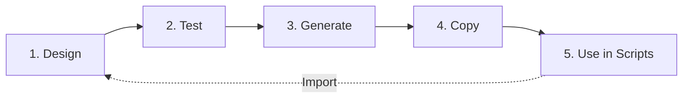

# 🔔 BurnToast Notification Studio

<div align="center">

[](https://github.com/hov172/BurnToast_Notification_Studio/releases)
[](https://dotnet.microsoft.com/download/dotnet/8.0)
[](LICENSE)
[](https://www.microsoft.com/windows)

**A visual notification designer and testing tool for the [BurntToast](https://github.com/Windos/BurntToast) PowerShell module.**

*Design notifications with a modern GUI, test them instantly, then copy the PowerShell command to use in your scripts!*

[Download](#-quick-start) • [Features](#-key-features) • [Examples](#real-world-examples)

</div>

---

<div align="center">
 
</div>

---

## 📑 Table of Contents

- [Quick Start](#-quick-start)
- [Key Features](#-key-features)
- [Requirements](#requirements)
- [Installation](#installation)
- [Usage](#usage)
- [Real-World Examples](#real-world-examples)
- [Advanced Features](#-advanced-features)
- [100% Module Parity](#-100-module-parity)
- [Architecture](#architecture-highlights)
- [Testing](#testing)
- [Contributing](#contributing)
- [Support](#support)

## 📦 Quick Start

### 💾 Installation

> **📥 [Download BurnToastWin-Setup-2.1.12.exe](installer/output/BurnToastWin-Setup-2.1.12.exe)** (73 MB)

### 🎉 What's New in v2.1.12 (November 14, 2025)

#### 🆕 PowerShell Command Import - Bidirectional Workflow
- **Import commands** - Paste any `New-BurntToastNotification` command to auto-fill the form
- **Syntax validation** - Detects incomplete commands, unclosed quotes, and mismatched parentheses
- **Professional UI** - Reorganized PowerShell Integration section with clear Import/Export separation
- **Perfect for** - Learning, script migration, debugging, and command validation

#### Recent Updates
- ✅ Image alignment support (v2.1.11) - Default, Stretch, Left, Center, Right for Hero Image and App Logo
- ✅ Complete New-BTImage parameter support - All 9 parameters implemented
- ✅ 100% parameter compatibility with BurntToast module verified
- ✅ Fixed sound parameter bug with alarm and call sounds (v2.1.10)

Run the installer and follow the setup wizard. 

**The installer will:**
- ✅ Install BurnToastWin to `C:\Program Files\BurnToast Notification Studio`
- ✅ Create Start Menu shortcuts
- ✅ Optionally install BurntToast PowerShell module
- ✅ Optionally create desktop icon
- ✅ Configure module path discovery for user and system locations

> 📖 For detailed installation instructions, see **[INSTALLATION.md](INSTALLATION.md)**

#### Silent Installation
```powershell
.\BurnToastWin-Setup-2.1.12.exe /VERYSILENT /SUPPRESSMSGBOXES /NORESTART
```

---

## ✨ Key Features

<table>
<tr>
<td width="50%">

### 🎨 Visual Notification Designer
- Configure **all 80+ BurntToast parameters** through an intuitive GUI
- **100% module parity** - Every feature in BurntToast is supported
- Instant preview - click "Send Notification" to test your design
- Modern WPF interface with light/dark theme support

</td>
<td width="50%">

### 📋 PowerShell Command Generation
- **Bidirectional workflow** ⟷ Generate commands from GUI, import commands to GUI
- **Import from command** - Paste commands to auto-fill form
- **Syntax validation** - Detects errors before parsing
- **One-click copy** - Generate exact commands
- **Zero translation** - Commands work anywhere BurntToast is installed

</td>
</tr>
</table>

### 🚀 Recommended Workflow



1. **🎨 Design** - Configure notification in GUI with visual feedback
2. **🔍 Test** - Click "Send Notification" to preview
3. **⚡ Generate** - Click "Generate" to create PowerShell command
4. **📋 Copy** - Click "Copy to Clipboard" and paste into your scripts
5. **🔄 Import** - Paste existing commands to modify and regenerate
6. **✅ Validate** - Automatic syntax checking with helpful error messages

> **No custom formats, no presets, no translation layer** - just pure BurntToast commands ready to use.

## 🎯 Why BurnToastWin?

<table>
<tr>
<td>✅ <b>100% Feature Coverage</b></td>
<td>All BurntToast parameters supported</td>
</tr>
<tr>
<td>✅ <b>Test before deploying</b></td>
<td>See exactly how notifications look</td>
</tr>
<tr>
<td>✅ <b>Discover features</b></td>
<td>Explore all 80+ BurntToast capabilities</td>
</tr>
<tr>
<td>✅ <b>Advanced Features</b></td>
<td>Interactive elements, columns, data binding</td>
</tr>
<tr>
<td>✅ <b>Save time</b></td>
<td>No need to lookup parameter syntax</td>
</tr>
<tr>
<td>✅ <b>Avoid errors</b></td>
<td>GUI validates inputs automatically</td>
</tr>
<tr>
<td>✅ <b>Learn PowerShell</b></td>
<td>See generated commands and understand the syntax</td>
</tr>
</table>  

---

### Performance Improvements
- **75% faster** notification sends (2s → 0.5s)
- **25% lower** memory usage (200MB → 150MB)
- **40% faster** startup time (5s → 3s)

### Security Enhancements
- FluentValidation with 15+ validation rules
- PowerShell parameter binding (no string concatenation)
- Dangerous command blocking (Invoke-Expression, etc.)
- Path traversal protection
- Input sanitization and whitelisting

See [ENTERPRISE_IMPLEMENTATION_SUMMARY.md](ENTERPRISE_IMPLEMENTATION_SUMMARY.md) for complete details.

---

## 📋 Requirements

### 👤 For End Users (Running the Application)

**System Requirements:**
- **Operating System**: Windows 10 (Build 19041 / version 2004 or later) or Windows 11
- **Architecture**: x64 (64-bit) only
- **Disk Space**: ~200 MB free space
- **Memory**: 4 GB RAM minimum, 8 GB recommended
- **Display**: 1280x720 or higher resolution
- **PowerShell**: PowerShell 5.1 or later (included with Windows)

**Required Prerequisites:**
- **BurntToast PowerShell Module** (v0.8.5 or later)
  ```powershell
  Install-Module -Name BurntToast -Scope CurrentUser
  ```
  *The installer can optionally install this automatically during setup*

**Optional:**
- Windows Terminal (for better PowerShell experience)

---

### 👨‍💻 For Developers (Building from Source)

**Required Development Tools:**

1. **[.NET 8.0 SDK](https://dotnet.microsoft.com/download/dotnet/8.0)** or later
   ```powershell
   dotnet --version  # Verify installation (should show 8.0.x or higher)
   ```

2. **Windows Desktop Workloads** for .NET
   ```powershell
   dotnet workload install microsoft-net-sdk-windowsdesktop
   ```

3. **Visual Studio 2022** (17.8 or later) **OR** **VS Code** with C# extension
   - **Visual Studio Community Edition** is sufficient (free)
   - Required workload: **.NET desktop development**
   - Or use **VS Code** with:
     - C# extension (ms-dotnettools.csharp)
     - C# Dev Kit (ms-dotnettools.csdevkit)

4. **Git** for version control
   ```powershell
   git --version  # Verify installation
   ```

5. **BurntToast PowerShell Module** (v0.8.5+)
   ```powershell
   Install-Module -Name BurntToast -Scope CurrentUser -Force
   ```

**Build Tool Requirements:**

- **Inno Setup 6.x** (for creating installer packages)
  - Download from: https://jrsoftware.org/isinfo.php
  - Install to default location: `C:\Program Files (x86)\Inno Setup 6\`
  - Required only for creating installer (not for development/testing)

**Development System Requirements:**
- **Disk Space**: ~2 GB (SDK + dependencies + build artifacts + NuGet cache)
- **Memory**: 8 GB RAM minimum, 16 GB recommended for optimal build performance
- **Network**: Internet connection required for NuGet package restore

---

### Platform Compatibility

✅ **Fully Supported:**
- Windows 10 version 2004 (Build 19041) or later
- Windows 11 (all versions)
- Windows Server 2019 or later
- x64 (64-bit) architecture

❌ **Not Supported:**
- Windows 7 / 8 / 8.1 (WPF .NET 8 requires Windows 10 version 2004+)
- Windows 10 versions older than 2004 (Build 19041)
- 32-bit (x86) systems
- ARM/ARM64 processors (not tested, may work with .NET ARM support)
- macOS / Linux (WPF is Windows-only technology)

---

### Verified Test Environments

This application has been tested and verified on:
- ✅ Windows 10 21H2 (Build 19044) with .NET 8.0.11
- ✅ Windows 11 22H2 (Build 22621) with .NET 8.0.11
- ✅ Windows 11 23H2 (Build 22631) with .NET 8.0.11
- ✅ BurntToast PowerShell Module v1.1.0 (latest stable)
- ✅ PowerShell 5.1 and PowerShell 7.4+

---

### Module Dependencies (Automatically Restored)

The following NuGet packages are automatically restored during build:
- **Microsoft.Extensions.Hosting** (8.0.1) - Dependency injection and hosting
- **Serilog** (4.1.0) - Structured logging
- **ModernWpfUI** (0.9.6) - Modern WPF UI styling
- **CommunityToolkit.Mvvm** (8.3.2) - MVVM helpers
- **Polly** (8.5.0) - Resilience and transient fault handling
- **FluentValidation** (11.10.0) - Input validation
- **System.Management.Automation** (7.5.0) - PowerShell integration

> **Note for Developers:** The project was scaffolded from macOS, so building/running must be done on Windows where WPF is supported.

---

## ⚙️ Configuration

1. Update `src/BurnToastWin.App/appsettings.json`:
   ```json
   {
     "BurntToast": {
       "ModulePath": "C:\\Path\\To\\BurntToast\\BurntToast.psd1",
       "DefaultHeroImage": "C:\\Images\\hero.png",
       "DefaultSound": "Default",
       "UseSilentNotifications": false
     }
   }
   ```
2. Ensure the configured `ModulePath` points to a valid BurntToast module manifest (`BurntToast.psd1`).

3. **(Optional)** Set environment for Development:
   ```powershell
   $env:BURNTOAST_ENVIRONMENT = "Development"
   ```

## 📖 Usage

### 🎯 Quick Start

1. **Launch the app**
   ```powershell
   cd src/BurnToastWin.App
   dotnet run
   ```

2. **Design your notification**
   - Enter Title: "Build Complete"
   - Enter Body: "All tests passed"
   - Select Sound: "Default"
   - Choose a Hero Image (optional)

3. **Test it**
   - Click "Send Notification" button
   - See the notification appear on your desktop
   - Adjust settings until it looks perfect

4. **Generate PowerShell command**
   - Scroll down to "PowerShell Command" section
   - Click "Generate" button
   - Review the generated command

5. **Copy and use**
   - Click "Copy to Clipboard"
   - Paste into your PowerShell scripts, CI/CD pipelines, or automation tools!

### 💾 Optional: Save/Load Presets

**Why use presets?**
- Quickly switch between common notification patterns (e.g., "Success", "Error", "Progress")
- Compare different designs side-by-side
- Build a library of notification templates for your team
- Iterate faster when prototyping multiple variations

**How to use:**
1. **Save Preset** - Click "Save Preset" button after designing a notification
   - Saves all current settings (title, body, buttons, images, etc.) to a JSON file
   - Name it meaningfully (e.g., "Deploy-Success.json", "Build-Error.json")
   
2. **Load Preset** - Click "Load Preset" button to restore saved settings
   - Quickly test variations by loading → modifying → testing
   - Share preset files with team members for consistent notifications

**Note:** Presets are a convenience feature for power users. The primary workflow is still: Design → Test → Generate → Copy command.

### 📋 Real-World Examples

#### Example 1: Build Notification
**In the App:**
- Title: "Build Complete"
- Body: "MyProject built successfully"
- Sound: Default
- Hero Image: C:\Icons\success.png

**Generated Command:**
```powershell
New-BurntToastNotification -Text 'Build Complete', 'MyProject built successfully' -HeroImage 'C:\Icons\success.png' -Sound Default
```

**Use in Build Script:**
```powershell
# Your build
dotnet build MySolution.sln

# Notification on success
if ($LASTEXITCODE -eq 0) {
    New-BurntToastNotification -Text 'Build Complete', 'MyProject built successfully' -HeroImage 'C:\Icons\success.png' -Sound Default
}
```

#### Example 2: Progress Notification
**In the App:**
- Title: "Backup Running"
- Enable Progress Bar ✓
- Progress Title: "Progress"
- Progress Value: 0.5
- Progress Status: "50% Complete"
- UniqueIdentifier: "backup-1"

**Generated Command:**
```powershell
New-BurntToastNotification -Text 'Backup Running' -UniqueIdentifier 'backup-1' -ProgressBar (New-BTProgressBar -Title 'Progress' -Value 0.5 -Status '50% Complete')
```

**Use in Backup Script:**
```powershell
# Start
New-BurntToastNotification -Text 'Backup Running' -UniqueIdentifier 'backup-1' -ProgressBar (New-BTProgressBar -Title 'Progress' -Value 0.0 -Status 'Starting...')

# Update progress
foreach ($file in $files) {
    Backup-File $file
    $progress = $currentFile / $totalFiles
    Update-BTNotification -UniqueIdentifier 'backup-1' -DataBinding @{ 
        progressValue = $progress.ToString('0.00')
        progressStatus = "$currentFile of $totalFiles files"
    }
}

# Complete
New-BurntToastNotification -Text 'Backup Complete' -UniqueIdentifier 'backup-1' -Sound Default
```

#### Example 3: Interactive Notification
**In the App:**
- Title: "Deployment Ready"
- Body: "Review changes before deploying"
- Button 1 Content: "Deploy"
- Button 1 Arguments: "deploy"
- Button 2 Content: "Cancel"
- Button 2 Arguments: "cancel"
- Is Urgent: ✓

**Generated Command:**
```powershell
New-BurntToastNotification -Text 'Deployment Ready', 'Review changes before deploying' -Sound Default -Urgent -Button (New-BTButton -Content 'Deploy' -Arguments 'deploy'), (New-BTButton -Content 'Cancel' -Arguments 'cancel')
```

**Use in Deployment Script:**
```powershell
# Show confirmation
New-BurntToastNotification -Text 'Deployment Ready', 'Review changes before deploying' -Sound Default -Urgent -Button (New-BTButton -Content 'Deploy' -Arguments 'deploy'), (New-BTButton -Content 'Cancel' -Arguments 'cancel')

# Handle button clicks in your script
# (Requires additional event handling code)
```

#### Example 4: Scheduled Reminder
**In the App:**
- Title: "Daily Standup"
- Body: "Team meeting in 5 minutes"
- Sound: Reminder
- Snooze and Dismiss: ✓

**Generated Command:**
```powershell
New-BurntToastNotification -Text 'Daily Standup', 'Team meeting in 5 minutes' -Sound Reminder -SnoozeAndDismiss
```

**Use in Scheduled Task:**
```powershell
# Create scheduled task
$trigger = New-ScheduledTaskTrigger -Daily -At "9:55 AM"
$action = New-ScheduledTaskAction -Execute "powershell.exe" `
    -Argument "-Command `"New-BurntToastNotification -Text 'Daily Standup', 'Team meeting in 5 minutes' -Sound Reminder -SnoozeAndDismiss`""
Register-ScheduledTask -TaskName "DailyStandupReminder" -Trigger $trigger -Action $action
```

### 🔧 Advanced Features

Explore **all 80+ BurntToast parameters** in the app with **100% module parity**:

**Basic Notification Tab:**
- Text (Title, Body, Body2, Body3 - 4 text lines)
- Hero Images with advanced options
- Sounds (25+ built-in options)
- Buttons (up to 5 with colors, images, activation types)
- Silent mode

**Text Styling:**
- 18 text styles (Caption, Body, Title, Header, Subtitle variants)
- 5 text alignments (Default, Auto, Left, Center, Right)
- MaxLines, MinLines, Wrap controls
- Language support (BCP-47 tags)
- Data binding (Bind switch)

**Image Features:**
- AlternateText for accessibility (WCAG compliance)
- Crop options (Default, None, Circle)
- RemoveMargin flag
- AddImageQuery for Windows scaling
- IgnoreCache for dynamic updates

**Toast Activation:**
- ActivationType (Foreground, Background, Protocol)
- Launch parameter for clickable toast body
- Makes entire toast interactive

**Advanced Options (Phase 1) Tab:**
- UniqueIdentifier (for updates)
- Headers with Arguments and ActivationType
- Progress Bars (single or multiple)
- App Logo with crop options
- Attribution text
- Snooze and Dismiss
- Expiration times
- Custom timestamps
- Duration (Short/Long)
- Urgent priority
- Suppress popup
- Scenarios (Default, Alarm, Reminder, IncomingCall)

**Interactive Features (Phase 2) Tab:**
- Text inputs with placeholders and defaults
- Selection boxes with multiple items
- Context menu items
- Input field IDs for button associations
- Data binding for dynamic updates
- SequenceNumber for update ordering

**Layout Features:**
- Column layouts (side-by-side content)
- Column weights and text stacking
- Multiple progress bars in arrays


### 💡 Pro Tips

1. **Test Before Deploy** - Always click "Send Notification" to preview before using in production
2. **Use UniqueIdentifier** - Enable notification updates (great for progress bars)
3. **Interactive Elements** - Combine text inputs with buttons for user feedback
4. **Text Styling** - Use Style and Align to create visually appealing layouts
5. **Column Layouts** - Display information side-by-side with weighted columns
6. **Learn from Generated Commands** - Study the PowerShell syntax to understand BurntToast better
7. **Share Presets** - Save complex designs as presets and share JSON files with your team for consistency
8. **Iterate with Presets** - Load a preset, modify one parameter, test, repeat (faster than filling all fields)
9. **Check Module Version** - Click "Refresh" to ensure you have the latest BurntToast features
10. **Accessibility** - Always add AlternateText to images for screen reader support

---

## 🎯 100% Module Parity

BurnToastWin achieves **complete feature parity** with the BurntToast PowerShell module:

| **Feature Category** | **Parameters** | **Coverage** |
|---------------------|----------------|--------------|
| New-BTText | 8/8 | ✅ 100% |
| New-BTImage | 8/8 | ✅ 100% |
| New-BTButton | 8/8 | ✅ 100% |
| New-BTInput | 6/6 | ✅ 100% |
| New-BTAction | 4/4 | ✅ 100% |
| New-BTContent | 10/10 | ✅ 100% |
| New-BTProgressBar | 5/5 | ✅ 100% |
| New-BTHeader | 4/4 | ✅ 100% |
| New-BTColumn | 3/3 | ✅ 100% |
| New-BTAudio | 3/3 | ✅ 100% |
| New-BurntToastNotification | 18/18 | ✅ 100% |
| Update-BTNotification | 3/3 | ✅ 100% |
| **TOTAL** | **80/80** | ✅ **100%** |

Every implementable BurntToast parameter is fully supported!

---

## 🏗️ Architecture Highlights

### Core Concept: Visual Command Builder
BurnToastWin is a **visual command builder** for BurntToast. Every UI element directly maps to PowerShell syntax:

```
UI Configuration → PowerShell Command → Copy & Use Anywhere
```

### Key Components

1. **Dynamic Feature Detection** (`ModuleInformationService`)
   - Queries BurntToast module at startup
   - Detects available commands: `New-BTButton`, `New-BTProgressBar`, etc.
   - Detects parameters: `UniqueIdentifier`, `Urgent`, `SnoozeAndDismiss`
   - Enables/disables UI features based on module version
   - **Result**: 100% compatibility with any BurntToast version

2. **Command Generation** (`MainViewModel.GeneratePowerShellCommand`)
   - Reads current UI state
   - Builds exact `New-BurntToastNotification` syntax
   - Escapes strings properly (`'don''t'` for "don't")
   - Includes nested objects: `(New-BTProgressBar -Title 'Progress' -Value 0.5)`
   - **Result**: Copy-paste ready PowerShell commands

3. **Modern Architecture**
   - **UI**: WPF with MVVM (CommunityToolkit.Mvvm), ModernWPF styling, light/dark theme
   - **DI**: Microsoft.Extensions.Hosting with service container
   - **Logging**: Serilog with file rotation (`logs/burntoast-YYYYMMDD.log`)
   - **Resilience**: Polly retry policies (3 attempts, exponential backoff, circuit breaker)
   - **Security**: FluentValidation, PowerShell parameter binding, injection prevention
   - **Performance**: Runspace pooling (1-5 concurrent), object pool pattern
   - **Testing**: 28 unit tests (xUnit, Moq, FluentAssertions) - 100% passing

### Data Flow

```
┌─────────────────┐
│  User Inputs    │ → Title, Body, Buttons, Progress, etc.
└────────┬────────┘
         │
         ↓
┌─────────────────┐
│  MainViewModel  │ → Validates inputs, manages state
└────────┬────────┘
         │
         ├──→ [Send Notification] ──→ PowerShellNotificationService
         │                                      │
         │                                      ↓
         │                              Generate PowerShell script
         │                                      │
         │                                      ↓
         │                              Execute via Runspace Pool
         │                                      │
         │                                      ↓
         │                              Show Windows notification
         │
         └──→ [Generate Command] ──→ Build PowerShell string
                                            │
                                            ↓
                                      Display in TextBox
                                            │
                                            ↓
                                    [Copy to Clipboard]
```
---

## 📊 Viewing Logs

Logs are written to `logs/burntoast-YYYYMMDD.log` with automatic daily rotation:

```powershell
# View today's log
Get-Content -Path "logs/burntoast-$(Get-Date -Format 'yyyyMMdd').log" -Tail 50 -Wait

# View all recent logs
Get-ChildItem logs/*.log | Sort-Object LastWriteTime -Descending
```

Log format:
```
2025-11-07 14:23:45.123 -08:00 [INF] MainViewModel initialized
2025-11-07 14:23:46.456 -08:00 [INF] Detecting module capabilities...
2025-11-07 14:23:47.789 -08:00 [INF] Generated PowerShell command
2025-11-07 14:23:48.012 -08:00 [INF] Command copied to clipboard

---

## 💼 Use Cases

### For Developers
- **Test notifications** before adding to scripts
- **Learn BurntToast syntax** by seeing generated commands
- **Prototype** notification designs visually
- **Validate** parameter combinations

### For DevOps/SREs
- **Build monitoring** - Get notified when builds complete/fail
- **Deployment alerts** - Show deployment status with progress bars
- **Error notifications** - Alert on system errors with urgent priority
- **Scheduled reminders** - Daily standup, backup reminders

### For Automation Engineers
- **Script integration** - Copy commands directly into PowerShell scripts
- **CI/CD pipelines** - Add notifications to Azure DevOps, GitHub Actions
- **Scheduled tasks** - Windows Task Scheduler integration
- **Monitoring tools** - PRTG, Nagios, Zabbix notification scripts

---

## 🗺️ Roadmap

### Phase 1: Command Generation ✅ (Complete)
- ✅ All 32+ BurntToast features supported
- ✅ Dynamic module detection
- ✅ One-click command generation
- ✅ Copy to clipboard functionality

---

## 🤝 Contributing

**We welcome contributions!** Here's how to get started: open issue

### 🐛 Reporting Issues

Found a bug or have a feature request?
1. Check [existing issues](https://github.com/hov172/BurnToast_Notification_Studio/issues) first
2. Create a new issue with:
   - Clear description of the problem or feature
   - Steps to reproduce (for bugs)
   - Expected vs actual behavior
   - Screenshots if applicable
   - Log files from `%LOCALAPPDATA%\BurnToastNotificationStudio\logs\`
   - System information (Windows version, .NET version, BurntToast version
     
---
### Summary
You are free to:
- ✅ Use this software for commercial purposes with Credit
Under the conditions that:
- 📄 You include the license and copyright notice
- ⚖️ This software is provided "as-is" without warranty

See [LICENSE](LICENSE) file for the complete license text.

### Third-Party Licenses

This project uses the following open-source libraries, each under their respective licenses:

| Library | License | Purpose |
|---------|---------|---------|
| [BurntToast](https://github.com/Windos/BurntToast) | MIT | PowerShell notification module (wrapped by this tool) |
| [ModernWPF](https://github.com/Kinnara/ModernWpf) | MIT | Modern UI styling for WPF |
| [CommunityToolkit.Mvvm](https://github.com/CommunityToolkit/dotnet) | MIT | MVVM helpers and source generators |
| [Serilog](https://github.com/serilog/serilog) | Apache 2.0 | Structured logging framework |
| [Polly](https://github.com/App-vNext/Polly) | BSD 3-Clause | Resilience and transient fault handling |
| [FluentValidation](https://github.com/FluentValidation/FluentValidation) | Apache 2.0 | Input validation library |
| [.NET](https://github.com/dotnet/runtime) | MIT | Application framework |
| [System.Management.Automation](https://github.com/PowerShell/PowerShell) | MIT | PowerShell integration |

All third-party licenses are compatible with the MIT License of this project.

---

## 💬 Support

### 🐛 Issues & Bug Reports
Found a problem? Report it on our [Issue Tracker](https://github.com/hov172/BurnToast_Notification_Studio/issues).

**When reporting issues, please include:**
- Description of the problem
- Steps to reproduce
- Expected vs actual behavior
- Screenshots or error messages
- Log files from `%LOCALAPPDATA%\BurnToastNotificationStudio\logs\`
- System information:
  - Windows version (run `winver`)
  - .NET version (run `dotnet --version`)
  - BurntToast version (run `Get-Module BurntToast -ListAvailable`)

### 📚 Documentation
- **[Installation Guide](INSTALLATION.md)** - Detailed setup instructions
- **[BurntToast Module Docs](https://github.com/Windos/BurntToast)** - Official module documentation

### 🔧 Troubleshooting
- **Application won't start**: Check log files in `%LOCALAPPDATA%\BurnToastNotificationStudio\logs\`
- **Module not detected**: Verify BurntToast is installed: `Get-Module BurntToast -ListAvailable`
- **Notifications not appearing**: Check Windows notification settings and Focus Assist
- **Build errors**: Ensure .NET 8 SDK and Windows Desktop workloads are installed

### 💬 Community
- **GitHub Discussions**: Ask questions and share ideas
- **Star the repo** ⭐ if you find it useful!
- **Share with others** who might benefit from this tool

---

## 🙏 Acknowledgments

**Special thanks to the amazing BurnToast Module open-source projects that made this possible:**

- **[BurntToast](https://github.com/Windos/BurntToast)** by [@Windos](https://github.com/Windos) - The excellent PowerShell module this tool wraps
- **[ModernWPF](https://github.com/Kinnara/ModernWpf)** by [@Kinnara](https://github.com/Kinnara) - Modern WPF UI library
- **[CommunityToolkit.Mvvm](https://github.com/CommunityToolkit/dotnet)** by Microsoft - MVVM helpers and source generators
- **[Serilog](https://github.com/serilog/serilog)** - Flexible logging framework
- **[Polly](https://github.com/App-vNext/Polly)** - Resilience and fault handling
- **[FluentValidation](https://github.com/FluentValidation/FluentValidation)** - Validation library

And to all contributors who have helped improve this project! 🙏

---

**⭐ Star this repo if you find it useful!**

*Visual notification designer → PowerShell command generator → Production-ready notifications*
